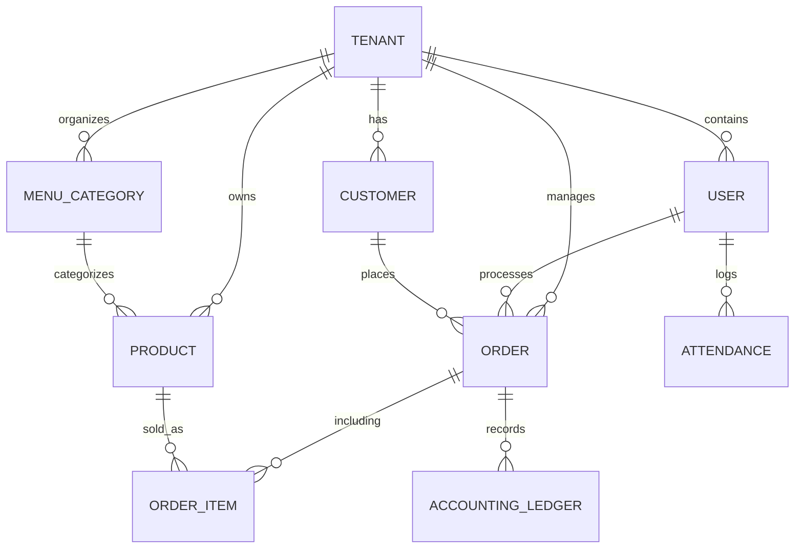

# Guía de Base de Datos

Orko utiliza **PostgreSQL** como motor de persistencia principal, gestionado a través de **TypeORM**.

## Esquema de Entidades (ERD)

## Tablas Principales

### `tenants`
Almacena la información de los negocios registrados. Es la raíz de la jerarquía.

### `users`
Almacena personal (Admin/Employee). Incluye el `tenant_id` para vinculación obligatoria.

### `orders`
Gestiona el flujo de ventas. Almacena montos, estados (`PENDING`, `PAID`) y referencias a mesas.

### `accounting_ledgers`
Libro diario contable. Registra automáticamente ingresos de pedidos y gastos manuales.

## Migraciones

Las migraciones se encuentran en `BBBackend/src/migrations`.
- Para generar una nueva: `npm run migration:generate -- src/migrations/Nombre`
- Para aplicar: `npm run migration:run`

> [!IMPORTANT]
> Nunca uses `synchronize: true` en entornos que no sean de desarrollo local para evitar pérdida de datos.
